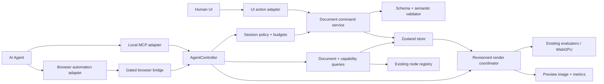

# Target Architecture for Agent Control

Status: **implemented through PR 8; Agent-ready v1 complete**

## Goals

The architecture must let a tool-using agent operate the same document model as
the human UI while preserving graph invariants, undo behavior, deterministic
rendering, and local-first privacy.

The design optimizes for:

- discoverability: an agent can inspect supported nodes without reading source;
- determinism: retries and seeded graphics produce predictable results;
- precision: commands target explicit layer/node IDs;
- atomicity: a plan either commits as one revision or does not mutate state;
- observability: mutation, render, and persistence status are distinct;
- safety: expensive and destructive actions are classified and bounded;
- adapter independence: MCP, browser tests, and future integrations share one
  domain API.

## Component model



The command service and validator are the key extraction. MCP is an adapter,
not the source of domain rules.

## Proposed module boundaries

```text
src/
  engine/
    graph.ts                 existing domain types
    registry.ts              existing runtime node definitions
  domain/
    documentSchema.ts        versioned structural validation
    capabilityManifest.ts    serializable registry projection
    commands.ts              command union and pure application logic
    commandErrors.ts         stable error codes
    semanticValidation.ts    graph/render invariants and budgets
    migrations.ts            document schema migrations
  agent/
    contracts.ts             JSON-safe public request/response types
    controller.ts            policy, revision, idempotency, transactions
    renderCoordinator.ts     revision-aware cook lifecycle
    preview.ts               readback, downsampling, image metrics
    browserBridge.ts         optional, gated global adapter
  store.ts                   Zustand integration and human UI state

packages/
  mcp-server/
    src/server.ts            local stdio MCP server
    src/localAppHost.ts      same-origin app + authenticated WebSocket host
    src/browserSession.ts    launches/connects to the locally hosted app
    src/tools.ts             maps MCP tools to AgentController
```

The exact paths can change, but dependencies should point inward:

```text
MCP/browser/UI adapters → controller/domain services → existing engine
```

The engine must never import MCP or browser-transport code.

## Document versioning

Wrap persisted/exported content in an explicit versioned envelope:

```ts
interface SerializedProjectV3 {
  format: "a-psychos-gd-tool";
  schemaVersion: 3;
  documentId: string;
  document: DocV3;
  assets?: AssetMetadata[];
}
```

Runtime revision is session state, not persisted content:

```ts
interface DocumentState {
  document: DocV3;
  revision: number;
  persistedRevision: number | null;
}
```

Migration rules:

1. values without an envelope are detected as the current legacy shapes;
2. `gfx.document.v1` single-graph documents migrate to a one-layer document;
3. `gfx.document.v2` layer documents gain the envelope and schema version;
4. migrations are pure and covered by fixtures;
5. a newer unsupported schema returns `UNSUPPORTED_SCHEMA_VERSION` and is never
   partially loaded;
6. successful import returns warnings for values normalized during migration;
7. legacy `Weight.source = "image"` becomes `"image luma"` explicitly;
8. zero/multiple Output nodes produce a diagnostic instead of selecting an
   object-enumeration winner.

Do not use the localStorage key version as a substitute for document schema
version. Exported documents travel independently of one browser origin.

## Capability manifest

Project the executable registry into a JSON-safe public descriptor:

```ts
interface CapabilityManifest {
  protocolVersion: "1.0";
  documentSchemaVersions: number[];
  socketTypes: SocketType[];
  nodes: PublicNodeDescriptor[];
  limits: AgentLimits;
  features: {
    transactions: true;
    dryRun: true;
    previews: true;
    assets: boolean;
    mcp: boolean;
  };
  preview: {
    formats: ["png", "webp"];
    defaultFormat: "png";
    metricsVersion: "preview-metrics-v1";
    capturePolicy: "current-exact-ticket-v1";
  };
}

interface PublicNodeDescriptor {
  type: string;
  label: string;
  category: string;
  description: string;
  inputs: PublicSocketDescriptor[];
  outputs: PublicSocketDescriptor[];
  params: PublicParamDescriptor[];
  traits: {
    usesFrame: boolean;
    requiresGpu: boolean;
    asynchronous: boolean;
    expensive: boolean;
    externalDownload: boolean;
  };
  execution: {
    runtime: "cpu" | "gpu" | "worker" | "model";
    network: "none" | "asset-read" | "model-download";
    cost: "low" | "medium" | "high";
    deterministic: boolean;
  };
}
```

The initial manifest can infer most fields from `NodeDef` and `PALETTE`.
Descriptions and traits should be added to `NodeDef` (or a colocated public
metadata object) so documentation, UI help, and Agent schemas share one source
of truth.

Schema-generation rules:

- `number` carries finite/minimum/maximum/step metadata; add an explicit integer
  trait where required;
- `color` is a strict six-digit hex schema;
- `select` is an enum and rejects unknown values;
- `showIf` remains an `x-ui-visible-if` hint, not a semantic rule that makes a
  hidden parameter invalid;
- current `binds` JSON strings are exposed to Agents as structured arrays and
  encoded by a compatibility codec; migrate the persisted representation in a
  later schema version;
- duplicate registry type IDs and defaults that fail their own schema are build
  errors, not silent overwrites.

Project `schemaVersion` identifies the envelope/storage generation (for
example, the version 4 asset manifest); it is not a promise that an older app
build understands node types or optional parameters introduced later within
that generation. Readers reject unknown fields. Features such as explicit
Place anchors therefore require a build whose capability manifest advertises
them, while omitted fields retain their registry defaults.

The manifest must not contain `cook`, Font objects, GPU handles, shader source,
or arbitrary functions.

## Public controller

```ts
interface AgentController {
  getCapabilities(request?: CapabilityRequest): CapabilityManifest;
  getDocument(request: GetDocumentRequest): DocumentSnapshot;
  validateDocument(request: ValidateDocumentRequest): ValidationReport;
  applyTransaction(request: TransactionRequest): Promise<TransactionResult>;
  getRenderStatus(request?: RenderStatusRequest): RenderStatus;
  awaitRender(request: AwaitRenderRequest): Promise<RenderResult>;
  capturePreview(request: PreviewRequest): Promise<PreviewResult>;
  revertTransaction(request: RevertTransactionRequest): Promise<TransactionResult>;
}
```

All arguments and results must be structured-clone/JSON safe.

The human UI may retain ordinary undo/redo. The public Agent contract should
prefer `revertTransaction(transactionId)` so it cannot accidentally undo a
newer human edit. A revert requires a compatible current revision or returns
`REVISION_CONFLICT`.

## Query contracts

### `getCapabilities`

Supports a compact default plus filters:

```json
{
  "nodeTypes": ["Text", "Outline", "Rasterize"],
  "include": ["sockets", "params", "traits"]
}
```

An empty request returns names, labels, categories, protocol versions, and
limits without returning every description on every turn.

### `getDocument`

```ts
interface GetDocumentRequest {
  revision?: number;
  layerIds?: string[];
  include?: Array<"frame" | "layers" | "nodes" | "edges" | "positions">;
  compact?: boolean;
}
```

`compact: true` may omit default-valued parameters and editor positions. The
response always states what was omitted.

### `validateDocument`

Validation modes:

- `structural`: schema, primitive types, IDs;
- `editable`: valid nodes, sockets, parameters, no dangling edges/cycles;
- `renderable`: required connections, per-layer Output, asset availability,
  and resource policy.

Validation must not mutate the current document unless `normalize` is
explicitly requested as part of a transaction.

## Transaction contract

```ts
interface TransactionRequest {
  requestId: string;
  expectedRevision: number;
  commands: DocumentCommand[];
  dryRun?: boolean;
  awaitRender?: boolean;
  renderTimeoutMs?: number;
  confirmationToken?: string;
}
```

`requestId` is scoped to an authenticated session. Once a request reaches a
stable fingerprint, repeating it returns the original result and reusing its ID
with different arguments returns `REQUEST_ID_REUSED`. A request rejected by the
transport/resource-size gate before hashing is non-mutating and may be retried
with corrected, smaller arguments under the same ID.

`expectedRevision` prevents the agent from overwriting a human edit made after
the agent planned its command batch.

### Command union

```ts
type DocumentCommand =
  | { op: "set_frame"; width: number; height: number }
  | { op: "add_layer"; clientRef: string; name?: string; afterLayerId?: LayerRef }
  | { op: "update_layer"; layerId: LayerRef; patch: LayerPatch }
  | { op: "move_layer"; layerId: LayerRef; index: number }
  | { op: "remove_layer"; layerId: LayerRef }
  | {
      op: "add_node";
      layerId: LayerRef;
      clientRef: string;
      nodeType: string;
      params?: Record<string, JsonValue>;
      position?: Point;
    }
  | {
      op: "set_node_params";
      layerId: LayerRef;
      nodeId: NodeRef;
      patch: Record<string, JsonValue>;
    }
  | {
      op: "move_nodes";
      layerId: LayerRef;
      positions: Array<{ nodeId: NodeRef; position: Point }>;
    }
  | { op: "remove_nodes"; layerId: LayerRef; nodeIds: NodeRef[] }
  | {
      op: "connect";
      layerId: LayerRef;
      from: { nodeId: NodeRef; socket: string };
      to: { nodeId: NodeRef; socket: string };
      replaceExisting?: boolean;
    }
  | {
      op: "disconnect";
      layerId: LayerRef;
      to: { nodeId: NodeRef; socket: string };
    }
  | { op: "auto_layout_graph"; layerId: LayerRef; direction?: "LR" | "TB" };
```

`clientRef` lets later commands refer to objects created earlier in the same
transaction:

```json
{
  "commands": [
    {
      "op": "add_node",
      "layerId": "layer_1",
      "clientRef": "headline",
      "nodeType": "Text",
      "params": { "content": "HELLO" }
    },
    {
      "op": "add_node",
      "layerId": "layer_1",
      "clientRef": "outline",
      "nodeType": "Outline"
    },
    {
      "op": "connect",
      "layerId": "layer_1",
      "from": { "nodeId": { "clientRef": "headline" }, "socket": "out" },
      "to": { "nodeId": { "clientRef": "outline" }, "socket": "in" }
    }
  ]
}
```

The result maps client references to durable IDs. Client references share one
transaction-local namespace across layers and nodes, must be unique, and may
only refer backward to an earlier command. The array form of `move_nodes` is
intentional: JSON object keys cannot represent the object form of `NodeRef`.
Durable node IDs are only unique within a layer, so every cross-layer node
identity includes both `layerId` and `nodeId`.
An ID allocated during a transaction remains reserved until that transaction
finishes even if its entity is deleted, so an earlier `clientRef` can never
silently resolve to a later entity through ID reuse.

### Transaction semantics

1. authenticate and enforce session policy;
2. capture and parse the complete caller-controlled request outside the state
   updater;
3. check the idempotency cache;
4. compare `expectedRevision` with the latest state after capture;
5. resolve existing IDs and transaction-local `clientRef`s;
6. apply commands to an isolated document draft;
7. perform semantic and resource validation;
8. if `dryRun`, return the proposed diff without committing;
9. commit one document snapshot and one undo entry;
10. increment revision once;
11. schedule render for that revision;
12. optionally await render;
13. persist and report persistence status;
14. cache and return the result.

No command in a failed transaction may update selection, document state,
history, persistence, or the renderer.

The in-process host uses two-phase finalization. Preparing an apply or revert
is pure with respect to the replay cache, transaction ledger, transaction-ID
sequence, and Zustand state. It returns an opaque one-shot finalization token.
An Agent request is safety-checked, normalized, and fingerprinted exactly once
into a deep-frozen handle authorized by the command module; the session applies
that handle without re-running the raw transport-size gate.
The host first builds the complete next state, history entry, and selection
revalidation; finalizing that token is its last non-trivial action before
returning the already-built full state replacement. Both captured-request and
finalization-token payloads live in module-private `WeakMap`s, not on the token
objects. This prevents Proxy reentrancy from capturing stale state, prevents a
host exception from caching a commit that never happened, and prevents callers
from altering ledger snapshots through token reflection.

The isolated draft is copy-on-write. Agent and human UI operations execute the
same command switch and per-command validation. The trusted UI profile can
skip base revalidation, canonical no-net comparison, and exact external change
summarization for a single command (or the UI's disconnect-only batch), but it
still performs request safety, revision, command, and final structural
validation. Operations that can change global asset or generated-work budgets
also run the resource-only semantic gate; movement and other resource-neutral
hot paths can skip that scan. Untouched layers, graphs, nodes, and edges retain
their references so drag and scrub history remains structurally shared.

Working-copy persistence also stays off continuous-edit hot paths: drag, scrub,
and typing saves are debounced and coalesced, with a best-effort page-hide
flush. Browser quota/private-mode failures preserve the previous safe save and
raise a visible `PERSISTENCE_FAILED` diagnostic. Non-bundled image bytes live
in a bounded content-addressed repository outside graph JSON; the controller
reports project checkpoint status independently from its in-memory commit and
render ticket.

If an input already has an edge, `connect` returns
`INPUT_ALREADY_CONNECTED` by default. The caller must set
`replaceExisting: true`; a successful result reports the complete replaced
edge. Version 3 edges do not have durable IDs.

The per-session replay cache and transaction ledger are bounded but
non-evicting. Once either budget is full, a new request is rejected rather than
forgetting a committed request ID and allowing a retry to mutate twice.

## Result and error model

```ts
interface TransactionSuccess {
  ok: true;
  requestId: string;
  dryRun: boolean;
  committed: boolean;
  transactionId: string | null;
  previousRevision: number;
  revision: number;
  proposedRevision: number;
  created: Record<string, string>;
  createdEntities: Record<
    string,
    { kind: "layer" | "node"; id: string; layerId?: string }
  >;
  changed: {
    frame: boolean;
    layerIds: string[];
    nodes: Array<{ layerId: string; nodeId: string }>;
    edgeCountDelta: number;
    replacedEdges: Array<{ layerId: string; edge: Edge }>;
  };
  warnings: AgentWarning[];
}

interface AgentFailure {
  ok: false;
  requestId?: string;
  revision: number;
  error: {
    code: AgentErrorCode;
    message: string;
    path?: string;
    commandIndex?: number;
    details?: Record<string, unknown>;
    recoverable: boolean;
    suggestedFix?: string;
  };
}
```

A dry run has `committed: false`, `transactionId: null`, an unchanged
`revision`, and `proposedRevision = revision + 1`. It performs the same command
and final-document validation but does not update the store, history,
persistence, renderer, ID allocation, or transaction ledger. Public results
now report transaction commit, project checkpoint, and render scheduling as
three separate facts.

Initial stable error codes:

```text
INVALID_ARGUMENT
UNSUPPORTED_SCHEMA_VERSION
UNKNOWN_LAYER
UNKNOWN_NODE
UNKNOWN_NODE_TYPE
UNKNOWN_PARAM
UNKNOWN_SOCKET
TYPE_MISMATCH
INPUT_ALREADY_CONNECTED
CYCLE_DETECTED
OUTPUT_MISSING
OUTPUT_AMBIGUOUS
REQUIRED_INPUT_MISSING
INVARIANT_VIOLATION
RESOURCE_LIMIT
ASSET_POLICY_VIOLATION
PERMISSION_REQUIRED
MODEL_DOWNLOAD_REQUIRED
CONFIRMATION_REQUIRED
REVISION_CONFLICT
REQUEST_ID_REUSED
RENDER_FAILED
RENDER_SUPERSEDED
WEBGPU_UNAVAILABLE
TIMEOUT
PERSISTENCE_FAILED
INTERNAL
```

Human-readable UI text should be derived from these errors. Do not make Agent
clients parse evaluator error strings.

The evaluator also needs a visiting-set cycle guard even though normal
transactions are validated. This turns a corrupt or bypassed graph into
`CYCLE_DETECTED` instead of recursive failure.

## Revisioned render coordinator

The current `busyRef`/`queuedRef` behavior should become an explicit service:

```ts
type RenderState = "idle" | "queued" | "cooking" | "complete" | "failed" | "superseded";

interface RenderStatus {
  documentRevision: number;
  renderRevision: number | null;
  state: RenderState;
  startedAt?: string;
  completedAt?: string;
  error?: AgentFailure["error"];
  events?: CookEventSummary[];
}
```

Rules:

- every scheduled cook is tagged with the document revision;
- if intermediate revisions are coalesced, they become `superseded`, not
  silently “successful”;
- `awaitRender({ revision })` resolves only for that revision's terminal state;
- preview/export results state the rendered revision;
- a failed render does not roll back a structurally valid document
  automatically, but the agent can revert its transaction when revisions permit;
- the last-known-good preview may remain visible and must be labeled with its
  older revision;
- `CookContext` and worker requests carry an `AbortSignal` and deadline;
- an obsolete/expired worker request is cancelled and its pending entry is
  cleared;
- each layer has an explicit validated output root rather than “first Output in
  object order”.

## Preview contract

```ts
interface PreviewRequest {
  revision: number;
  // Optional exact-attempt extension. If omitted, the latest attempt is bound
  // atomically when the call begins and never followed to a later retry.
  attempt?: number;
  maxWidth?: number;
  maxHeight?: number;
  format?: "png" | "webp";
  includeMetrics?: boolean;
}

interface PreviewResult {
  requestedRevision: number;
  revision: number;
  attempt: number;
  sourceWidth: number;
  sourceHeight: number;
  width: number;
  height: number;
  mimeType: string;
  byteLength: number;
  contentHash: string;
  rgbaSha256: string;
  capturePolicy: "current-exact-ticket-v1";
  image: BinaryHandle;
  metrics?: {
    version: "preview-metrics-v1";
    alphaCoverage: number;
    nonBackgroundBounds: { x: number; y: number; width: number; height: number } | null;
    luminance: { min: number; max: number; mean: number };
    perceptualHash: string;
    background: {
      premultipliedRgba: [number, number, number, number];
      confidence: number;
    } | null;
  };
}
```

MCP should return an image content item or a temporary-file handle rather than
embedding a full-resolution base64 string in ordinary JSON. Preview defaults
should be bounded; full-resolution PNG remains a separate export operation.

`preview-metrics-v1` is frozen as follows:

- `alphaCoverage` is mean normalized alpha, `sum(alpha) / (255 * pixels)`;
- luminance uses the exact sRGB transfer function, composites transparent
  pixels over white in linear light, and reports min/max/mean over every final
  preview pixel;
- background detection builds an 8-value-quantized histogram from all border
  pixels in premultiplied RGBA, requires at least 50% dominance, and uses a
  per-channel tolerance of 4; without a dominant border, non-background bounds
  conservatively cover the whole frame;
- fully transparent output has null non-background bounds;
- perceptual hash is a 64-bit lowercase hexadecimal DCT pHash over a
  deterministic 32x32 white-matted linear-luminance image. It is similarity
  evidence only, never an integrity or authorization hash.

Preview capture uses `current-exact-ticket-v1`: the requested ticket must be the
current document's completed and displayed artifact before GPU readback and
again after encoding. A newer document revision or same-revision render attempt
rejects the result as `RENDER_SUPERSEDED`. The GPU downsamples before CPU
readback; a bounded, single-active worker computes metrics and PNG/WebP
encoding, and termination is the cancellation mechanism for native encoding.
Encoded bytes, queued pixel bytes, worker count, attempts, and the shared
absolute deadline are all hard-bounded by the capability manifest.

## Asset boundary

The public command API ingests assets separately:

```ts
interface AssetMetadata {
  id: string;
  sha256: string;
  mimeType: "image/png" | "image/jpeg" | "image/webp";
  byteLength: number;
  width: number;
  height: number;
  source: "upload" | "generated" | "bundled";
}
```

Implemented tools:

- `put_asset` — bounded binary ingestion, returns `assetId`;
- `list_assets`;
- `remove_asset` — only when unreferenced, or with confirmation;
- `get_asset_metadata`.

Public `Image` creation references an `assetId`. Migration accepts legacy data
URIs and the fixed `/factory-image.jpg` reference internally, verifies them,
and emits a version 4 manifest. Human Save Project/Load Project actions use a
strict portable envelope containing verified non-bundled bytes; the Agent has
no project-replacement or filesystem authority.

Default policy:

- no arbitrary HTTP(S) document asset URLs;
- explicit MIME allowlist;
- encoded-byte, decoded-pixel, and dimension limits;
- content hash/deduplication;
- no image bytes or data URIs in logs;
- model downloads are separately disclosed and permission-gated.

The origin-shared IndexedDB CAS is capped at 256 MiB and deliberately performs
no process-local destructive GC: another tab's retention set is unknowable.
At the cap it fails closed with `RESOURCE_LIMIT`. Process-local memory fallback
storage may reclaim only records outside current/history/session/staging and
last-durable-save retention sets.

## Browser bridge

Replace the raw store global with a narrow controller:

```ts
declare global {
  interface Window {
    gfxAgentPairing?: AgentPairingBootstrap;
    gfxAgent?: AgentController;
  }
}
```

Enable it only when all configured conditions hold, for example:

- an explicit static Agent artifact hosted on the fixed loopback origin;
- an explicit interactive approval or an explicit versioned Trusted Local
  startup policy;
- a short-lived, in-memory session credential;
- an exact top-level, secure owning-page realm/origin and loopback check.

Before pairing, only the narrow `gfxAgentPairing` bootstrap exists and
`gfxAgent` is `undefined`. PR 5 can validate the page realm and the bundled
preview host. PR 6 owns per-request HTTP `Host`, WebSocket upgrade `Origin`,
connection authentication, and transport budgets.

Do not expose generic `call(methodName, args)` dispatch. Export named,
allowlisted methods so the callable surface is auditable.

Default and Agent artifacts expose neither `__app` nor `__render`; all browser
tests use the paired controller or app-owned semantic UI.

## MCP adapter

The first MCP server should be a local companion over stdio that also hosts the
Agent-enabled app build and same-origin WebSocket bridge:

```text
MCP client ↔ stdio server/local app host ↔ authenticated same-origin WebSocket
                                           ↕
                                      Chrome + AgentController
```

Puppeteer, already present in development dependencies, may launch Chrome and
navigate to the local app. Normal tool calls must use the narrow bridge, not
arbitrary CDP/page evaluation. The companion should:

- bind the app/WebSocket host to `127.0.0.1`/`::1`, never `0.0.0.0`;
- reject wildcard, `null`, and unexpected Host/Origin values;
- generate at least 256 bits of per-session entropy kept out of localStorage,
  normal query parameters, and logs;
- expire, heartbeat, and revoke sessions, with a persistent UI connected-state
  indicator and kill switch;
- enforce one owner per document/browser session;
- limit message size, request rate, concurrent transactions, and pending
  renders;
- expose no generic filesystem or browser-eval tool;
- return bounded, redacted tool results;
- terminate the browser session it created;
- surface WebGPU and permission prerequisites clearly.

The hosted Vercel page should not connect directly to a localhost bridge in the
first release. Hosting the Agent build and bridge together makes the Origin
boundary explicit and testable.

Recommended initial MCP tools:

| Tool | Risk | Purpose |
| --- | --- | --- |
| `gfx_get_capabilities` | read | Discover node schemas, limits, and protocol version |
| `gfx_get_document` | read | Read a compact revisioned snapshot |
| `gfx_validate_document` | read/compute | Validate current or proposed document |
| `gfx_apply_transaction` | write | Apply atomic graph/layer commands |
| `gfx_get_render_status` | read | Inspect exact revision state/errors |
| `gfx_await_render` | read/wait | Wait for a revision terminal state |
| `gfx_capture_preview` | read/compute | Return bounded visual evidence |
| `gfx_measure_rendered_nodes` | read/compute | Return exact-ticket painted bounds and frame-clipping diagnostics |
| `gfx_revert_transaction` | write | Conflict-safe revert of a named Agent transaction |

Do not create one MCP tool per node type. Node types are data described by the
capability manifest; `add_node` remains a command inside a transaction.

Bounded content-addressed asset tools and pinned local model status/preparation
tools subsequently shipped behind their independent scopes. Document
replacement, arbitrary fetch, and filesystem export remain human-only or
absent from MCP.

## Session scopes

Grant capabilities per paired session:

| Scope | Allows |
| --- | --- |
| `read` | capability/document summaries, graph inspection, render status |
| `preview` | bounded rendered previews/metrics and exact-ticket node clipping measurements |
| `edit` | validated, reversible document transactions |
| `assets` | bounded binary asset ingestion |
| `model` | execution of an already approved/pinned model |
| `export` | creation of a user-approved external artifact |

In interactive mode, scope elevation occurs only through an in-app control and
a browser-trusted event. Trusted Local is a separate operator-selected startup
policy: it grants only the scopes pinned by its versioned profile, never future
scopes implicitly, and remains bounded by process, transport, and session
lifetime. Browser approval and Trusted Local startup are therefore both human
authorization decisions; neither is an Agent-callable scope-elevation tool.

The interactive check rejects page-script synthetic events; `Event.isTrusted`
is not cryptographic proof of a physical human because CDP can synthesize
trusted input. The MCP threat boundary therefore must not expose CDP input,
navigation, or page evaluation to the Agent. A product that must resist an
Agent already controlling the browser needs an out-of-band
native/WebAuthn/OS confirmation. Agents may not request Local Font Access,
enumerate unapproved local font families, navigate the browser, evaluate
JavaScript, issue arbitrary network requests, or access generic files/shell
commands.

Document strings, asset metadata, and preview contents are labeled as untrusted
content in tool results. Instructions rendered inside a poster must never
change scopes or confirmation policy.

## Risk and confirmation policy

Classify operations:

| Class | Examples | Default |
| --- | --- | --- |
| Read | capabilities, document snapshot, render status | allowed |
| Reversible write | add/set/connect in bounded transaction | allowed within session policy |
| Expensive | 4K render, Trace, Remove Background, large preview | budgeted; disclose or require permission |
| Destructive | replace document, clear layers/assets, discard newer human revision | explicit confirmation token |
| External effect | remote download, filesystem export outside managed temp area | explicit policy/confirmation |

The application controller enforces policy even if an MCP client mistakenly
labels a tool as safe.

Confirmation tokens are single-use, short-lived, and bound to a SHA-256 digest
of the canonical proposed request. A token approved for one export, document
replacement, or model preparation cannot authorize modified arguments.

The first Agent write creates a session checkpoint. Reverting an Agent
transaction is allowed only when the current revision is compatible; it must
not invoke ordinary global undo and accidentally remove a later human edit.
Agent-ready v1 uses strict head-only compatibility: the target committed
revision must equal the current revision and the SHA-256 digest of the complete
version 3 project envelope must still match. A successful revert restores the
exact before snapshot as a new revision and a new history entry.

## Resource limits

Expose effective limits in the capability manifest. Proposed conservative v1
defaults (configurable downward/upward by an explicit local policy) are:

| Resource | Proposed default |
| --- | --- |
| Document JSON, excluding binary assets | 2 MiB |
| Layers | 32 |
| Nodes | 256 per layer, 1024 per document |
| Edges | 1024 per layer, one per input socket |
| Frame | 16–4096 each side, at most 4096² pixels |
| Transaction | 2 MiB request, 100 commands, 100 client refs, at most 200 touched nodes |
| Session replay cache | 256 non-evicting request IDs |
| Transaction ledger | 256 records and 256 MiB of exact before snapshots |
| IDs/names | ASCII-safe IDs ≤128 chars; names ≤128 chars |
| Expressions | 2 KiB |
| Asset | 20 MiB and 32 MP each; 64 MiB per document |
| Preview | longest side 1024; response ≤4 MiB |
| Ordinary render | 30-second default deadline |

In addition:

- every number must be finite and satisfy registry constraints;
- unknown parameters are rejected outside explicit migrations;
- IDs reject prototype-sensitive names such as `__proto__`, `constructor`, and
  `prototype`;
- Duplicator/generated-placement totals have document-level budgets;
- import validation performs no network/model work;
- free GPU textures are byte-accounted and LRU-evicted over a soft budget;
- rapid frame changes and expensive/model-backed nodes are rate/cost limited.

Start from existing UI constraints, then add document-level totals. Limits must
be configurable for tests and local advanced use, but never absent.

## GUI automation semantics

Programmatic tools are primary, but the human UI should remain testable and
accessible. React Flow already supplies useful node/edge roles and IDs; add
application-owned stable attributes and unique accessible names rather than
depending on React Flow private classes:

```html
<div data-agent-layer-id="layer_1"
     data-agent-node-id="text_1"
     data-agent-node-type="Text"
     aria-label="Text node text_1 in layer Typography">
<input data-agent-param="fontSize" aria-label="Text text_1 font size">
<button data-agent-socket="out"
        data-agent-direction="output"
        aria-label="Text text_1 output out, text">
<div data-agent-render-revision="42" data-agent-render-state="complete">
```

Stable identifiers should cover:

- layer rows and controls;
- node cards, socket handles, and parameters;
- palette categories/types;
- frame controls and export;
- render status, cook errors, and preview revision.

Add a keyboard-accessible connection inspector/mode so a user or GUI Agent can
select source and target sockets without hitting the current tiny drag handles.
Connection validation returns a structured reason and announces success/failure
through a persistent live region.

Numeric parameters remain real spinbuttons in the DOM (scrubbing is an
additional pointer affordance); the local-font control follows the combobox
pattern; layer rows support keyboard select, rename, visibility, and reorder.
The main preview is the only `role=img`/`data-agent-preview`; the layout guide is
separately identified and `aria-hidden`.

New-node placement must use measured card size/collision avoidance and avoid
palette/layer overlays. Coordinate-based socket drag remains a human/UI
regression test, not the Agent's normal control path.

## End-to-end example

An agent creating a simple typographic poster:

1. `gfx_get_capabilities` filtered to Text, Outline, Rasterize, Output.
2. `gfx_get_document` in compact mode.
3. `gfx_apply_transaction` with `expectedRevision`, adding and connecting the
   nodes in one batch.
4. Tool returns revision 8 and created ID mappings.
5. `gfx_await_render({ revision: 8 })`.
6. `gfx_measure_rendered_nodes` for any text/vector/Place outputs that need
   clipping checks, using the exact revision and attempt returned above.
7. `gfx_capture_preview({ revision: 8, maxWidth: 768 })`.
8. Agent evaluates preview and sends a second transaction changing color/warp.
9. On a poor result,
   `gfx_revert_transaction({ requestId: "revert-1", transactionId, expectedRevision: 9 })`.

No pointer coordinates or raw store access are involved.

## Alternatives considered

### Browser clicks only

Rejected as the primary interface because graph wiring, viewport transforms,
and canvas interpretation make it slow and fragile. Retained as a UI regression
path.

### Puppeteer/CDP as the production command transport

Rejected because arbitrary page evaluation grants far more browser authority
than the design tool needs and makes private implementation the protocol.
Puppeteer remains useful for browser launch and E2E tests; normal MCP calls use
the authenticated, allowlisted bridge.

### MCP server mutates localStorage directly

Rejected because it bypasses validation, history, revision tracking, live
render scheduling, and migrations.

### MCP server imports the Zustand store in Node

Rejected because store initialization assumes browser APIs, fonts, and
localStorage, while render completion exists in the browser/GPU process.

### Expose the full store globally in production

Rejected because it makes internal implementation the protocol, permits
unreviewed actions, and cannot enforce per-command policy.

### One MCP tool per node type

Rejected because it creates a large, drifting tool surface. Registry-derived
node descriptors plus a single transactional graph tool are more compact and
consistent.
