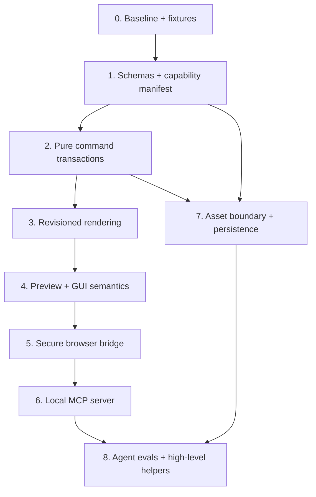

# Agent Adaptation Implementation Plan

Status: **proposed**

This plan is intentionally split into reviewable pull requests. Each step
produces useful internal quality improvements even if later MCP work is paused.

## Delivery principles

- preserve current human editing behavior;
- do not couple engine code to one Agent vendor or model;
- land validation and transactions before exposing external writes;
- keep every new public contract versioned and JSON-safe;
- retain one-click local development;
- keep the bridge disabled unless explicitly configured;
- require tests for every invariant before enabling the corresponding MCP tool.

## Workstream overview

## PR 0 — Freeze the baseline

### Scope

- add representative saved-document fixtures:
  - current factory document;
  - legacy single-graph save;
  - layered localStorage save;
  - documents containing each node type;
- add an inventory test asserting that the palette and registry agree;
- record current smoke-test commands and WebGPU prerequisites;
- add deterministic screenshot fixtures at a small frame size;
- make existing smoke scripts use a shared Chrome-launch helper.
- add a defense-in-depth evaluator visiting-set guard so a bypassed cyclic graph
  returns `CYCLE_DETECTED` instead of recursing.

### Why first

The store and render scheduling will be refactored. Baseline fixtures make it
possible to prove that existing projects still load and render.

### Acceptance

- all current unit tests remain green;
- factory fixture node/layer counts are asserted;
- a fixture renders without console/page errors in WebGPU Chrome;
- tests do not depend on a developer's previous localStorage.

## PR 1 — Versioned schemas and capability manifest

### Scope

- wrap saved/exported projects in an explicit versioned format envelope;
- define structural schemas for document, layer, graph, node, edge, and frame;
- implement pure migrations for the two existing localStorage shapes;
- implement semantic validation:
  - known node type;
  - known parameter;
  - parameter kind/range/enum;
  - known sockets and edge endpoints;
  - type compatibility;
  - acyclicity;
  - required Output per layer;
  - configurable resource budgets;
- migrate legacy `Weight.source = "image"` and diagnose ambiguous Output roots;
- project `PALETTE`/`registry` to a JSON-safe capability manifest;
- add node descriptions and risk/compute traits without changing cook behavior;
- add explicit document JSON export/import in an internal API; UI buttons may
  follow in this PR or the next.

### Design notes

- JSON Schema should be exportable for MCP clients.
- Runtime semantic checks remain TypeScript functions because cross-node graph
  rules are not usefully expressed in JSON Schema alone.
- The validator returns all safe-to-report findings, not just the first.
- Existing saves normalize through migration before validation.

### Acceptance

- every built-in node produces a serializable descriptor;
- registry/schema drift fails CI;
- duplicate node type IDs and invalid registry defaults fail CI;
- malformed params, dangling edges, bad sockets, cycles, missing Output, and
  oversized frames produce stable codes and JSON paths;
- every existing fixture either migrates successfully or fails without changing
  current state;
- import/export round-trips a valid document.

## PR 2 — Pure command and transaction service

### Scope

- define the `DocumentCommand` union;
- add explicit layer IDs to every graph command;
- support transaction-local `clientRef` IDs;
- implement `applyTransaction` against an isolated document draft;
- return created-ID mappings and a compact change summary;
- implement `dryRun`;
- add `expectedRevision`;
- add bounded per-session `requestId` replay cache;
- commit one transaction as one undo step;
- return a durable `transactionId` and provide conflict-safe transaction revert;
- make connection replacement explicit (`replaceExisting`) and report the
  replaced edge;
- route existing Zustand document actions through the command service where
  practical;
- keep UI-only selection/camera state outside the domain command result.

### Refactor requirements

- current UI behavior and shortcuts must remain unchanged;
- an invalid action must return an error instead of silently no-oping at the
  domain boundary;
- the UI adapter may translate errors into current no-op behavior temporarily,
  but tests should exercise the structured result;
- `addNode` must return its durable ID directly;
- removing the required Output node must be rejected or paired with a
  replacement in the same transaction.

### Acceptance

- a multi-node graph can be created and wired in one transaction;
- one invalid command rolls back the entire batch;
- the batch adds exactly one history entry;
- a dry run has no store, history, persistence, or render side effects;
- retrying the same `requestId` does not duplicate nodes;
- a stale `expectedRevision` cannot overwrite a human edit;
- reverting an Agent transaction cannot undo a later human edit;
- commands do not depend on `activeLayerId`.

## PR 3 — Revisioned render coordinator

### Scope

- replace component-local busy/queue state with a testable render coordinator;
- tag every scheduled cook with its document revision;
- expose queued/cooking/complete/failed/superseded states;
- implement `getRenderStatus` and `awaitRender`;
- associate cook events and errors with layer, node, and revision;
- label the displayed canvas with its rendered revision;
- preserve evaluator caches per layer;
- make PNG export request a specific rendered revision.
- add `AbortSignal`/deadline propagation through async cook and worker requests;
- add pending-worker queue limits and recovery after timeout/termination;
- byte-account pooled GPU textures and LRU-destroy free textures over budget;
- surface device-loss and resource-limit errors.

### Acceptance

- a command result never claims render success before GPU completion;
- an intermediate coalesced revision becomes `superseded`;
- `awaitRender` cannot accidentally resolve on a later unrelated render;
- render errors include a stable code and originating layer/node when known;
- last-known-good preview revision is distinguishable from current document
  revision;
- deleting a layer still disposes its evaluator/cache.
- repeated frame-size churn stays inside the configured GPU pool byte budget.

## PR 4 — Preview evidence and stable UI automation

### Scope

- implement bounded preview readback/downsampling;
- return PNG/WebP plus revision and dimensions;
- compute basic preview metrics:
  - alpha coverage;
  - non-background bounds;
  - luminance min/max/mean;
  - perceptual hash;
- add stable selectors and accessible labels for nodes, sockets, parameters,
  layers, render state, and errors;
- add a keyboard/DOM connection inspector or mode that does not require socket
  pointer dragging;
- make numbers real spinbuttons, the font picker a standards-compliant
  combobox, and layer rows/actions fully keyboard operable;
- add collision-aware node placement that avoids fixed floating panels;
- migrate Puppeteer selectors away from incidental CSS where possible;
- add persistent live status for terminal render state and `role=alert` errors;
- identify exactly one main preview and hide the guide canvas from assistive
  technology.

### Acceptance

- a blank/fully transparent output is machine-detectable;
- preview bytes and metrics refer to the requested completed revision;
- two nodes of the same type remain individually targetable in the DOM;
- panning/zooming does not break semantic parameter selectors;
- screenshot size and encoded byte count respect configured bounds;
- current marquee and visual smoke checks still pass.
- the Text → Outline → Rasterize → Output happy path runs without pixel
  coordinates, React Flow private selectors, hard-coded generated IDs, forced
  clicks, or fixed sleeps;
- accessibility scans have zero serious/critical findings and no unnamed
  button/input/canvas;
- adding 20 nodes produces no node/node or node/fixed-panel overlap.

### Quantitative GUI/Agent gate

- 100% of node/layer/socket/parameter/action targets have a unique accessible
  name;
- the Text → Outline → Rasterize → Output scenario succeeds 50 consecutive
  times with no coordinate, forced-click, private-class, fixed-sleep, or
  hard-coded generated-ID dependency;
- missing node/socket, type mismatch, and cycle connection failures always
  return stable diagnostics and leave graph/revision unchanged;
- every mutation reaches one terminal render event within policy timeout, and
  capture is allowed only when `renderedRevision === documentRevision`;
- the page contains exactly one main preview selector; capture returns revision,
  dimensions, content hash, and image bytes;
- if raw socket drag remains a supported automation target, its effective
  screen hit region is at least 24×24 CSS pixels at default fit; otherwise the
  keyboard connection mode is the required equivalent;
- layer selection/rename/visibility/reorder, number editing, and font selection
  all complete with keyboard-only interaction.

## PR 5 — Gated browser AgentController

### Scope

- implement the JSON-safe `AgentController`;
- expose it through an explicit build/runtime gate;
- add nonce/token handshake and allowed-origin checks;
- add an in-app pairing/revoke flow and visible connected/scope state;
- support explicit `read`, `preview`, `edit`, `assets`, `model`, and `export`
  scopes that only the human can grant;
- expose named allowlisted methods only;
- redact sensitive/large data from diagnostics;
- self-host UI fonts in Agent mode and add restrictive CSP, Referrer-Policy,
  Permissions-Policy, and `frame-ancestors` headers;
- migrate smoke tests from raw `__app` state access to the controller;
- retain `__app` only during a deprecation window, then remove it.

### Acceptance

- production default build has no Agent global;
- enabled builds expose no Zustand setters, GPU handles, Font objects, or
  generic JavaScript evaluation;
- an unauthenticated bridge call fails;
- wrong Host/Origin, expired/replayed token, and revoked session calls fail;
- document text/preview payloads are marked untrusted and cannot change scopes;
- controller requests and responses survive structured cloning/JSON encoding;
- all controller writes pass through transaction validation and policy;
- browser tests no longer need private store knowledge.

## PR 6 — Local MCP companion

### Scope

- add a workspace/package for an stdio MCP server;
- host the Agent-enabled app and WebSocket on loopback/same origin;
- launch or attach to a supported Chrome with WebGPU and pair through the
  authenticated bridge;
- expose the initial MCP tools listed in the architecture document;
- forward structured errors without flattening them into prose;
- return preview as image content or a managed temporary artifact;
- add server startup/health diagnostics;
- document installation, Chrome selection, and session lifecycle.

### Tool enablement order

1. `gfx_get_capabilities`
2. `gfx_get_document`
3. `gfx_get_render_status`
4. `gfx_validate_document`
5. `gfx_apply_transaction`
6. `gfx_await_render`
7. `gfx_capture_preview`
8. `gfx_revert_transaction`

Asset tools remain disabled until PR 7 policy is complete.

### Acceptance

- a clean MCP session can create a valid text-to-output graph without pointer
  interactions;
- invalid wiring returns `TYPE_MISMATCH` and leaves revision unchanged;
- a duplicate tool retry does not duplicate mutations;
- preview returned by MCP matches the committed/rendered revision;
- the server listens only where documented and rejects an invalid session
  token/Origin;
- no tool offers generic page evaluation, shell, or filesystem traversal.
- the first rollout can expose read/preview tools without enabling write scope.

## PR 7 — Asset and persistence boundary

### Scope

- add content-addressed asset storage and metadata;
- replace public arbitrary image `src` input with `assetId`;
- migrate existing data URI and bundled image references;
- enforce MIME, encoded byte, decoded pixel, and dimension policies;
- report local persistence failures;
- add explicit project save/load/export/import;
- add `put_asset`, `list_assets`, and safe removal;
- classify model-backed nodes and require policy approval for first download;
- pin/self-host model bytes and verify their integrity;
- make local-font permission requirements machine-readable.

### Acceptance

- imported graph JSON cannot cause arbitrary remote image fetches;
- no URL-import tool exists in v1;
- oversized or unsupported assets fail before decode/upload;
- logs and tool responses never contain full data URIs or asset bytes unless the
  specific binary tool requests them;
- save/load round-trip keeps asset references intact;
- localStorage/quota failure is visible to the controller;
- model download and local-font permission states return stable errors.
- the Agent cannot request Local Font Access or enumerate unapproved font
  families.

## PR 8 — Agent evaluation suite and high-level helpers

### Scope

- add scripted tasks that exercise realistic design workflows;
- add golden document and preview assertions;
- add high-level, deterministic helpers only where repeated low-level plans are
  demonstrably wasteful:
  - duplicate a subgraph;
  - auto-layout a graph;
  - create from a reviewed template;
  - replace an asset while preserving downstream graph;
- measure tool calls, invalid plans, retries, render latency, and successful
  recovery;
- document example prompts and expected tool traces.

### Acceptance scenarios

1. **Typography chain:** create Text → Outline → Warp → Rasterize → Recolor →
   Output and produce a nonblank preview.
2. **Circular type:** create Text → Split and Math Function → Place → Output
   with valid typed sockets.
3. **Masked scatter:** ingest an image, create a mask-driven Grid/Random layout,
   place duplicated shapes, and render.
4. **Human edit conflict:** reject a stale agent transaction, re-read, re-plan,
   and succeed without losing the human change.
5. **Bad plan recovery:** reject a raster-to-vector direct connection, report
   the explicit conversion required, then accept the corrected plan.
6. **Render failure recovery:** surface the failing revision and successfully
   revert the responsible Agent transaction.
7. **Retry:** replay a timed-out request ID and return the original created IDs.

## Cross-cutting test matrix

| Layer | Tests |
| --- | --- |
| Schema | fixtures, migration, unknown fields, bounds, fuzzed malformed JSON |
| Semantics | sockets, unions, cycles, required inputs, Output invariant, budgets |
| Commands | every operation, client refs, dry-run, rollback, diff summary |
| Concurrency | expected revision, human/agent race, idempotency replay |
| History | one transaction/one undo, redo, failed transaction/no history |
| Render | queued/coalesced/failure/timeout, layer cache disposal, exact revision |
| Preview | dimensions, metrics, blank output, byte limits, revision matching |
| Security | host/origin/token/replay/revoke, URL policy, payload limits, redaction, permission gates, prompt-injection content labeling |
| Browser | semantic selectors, keyboard paths, socket drag fallback, WebGPU |
| MCP | schema discovery, structured errors, image content, session teardown |

Add property-based or fuzz tests for command sequences once the pure transaction
service lands. Important invariants after every successful sequence:

- every edge endpoint and socket exists;
- every edge is type-compatible;
- no graph contains a cycle;
- IDs are unique within their scope;
- IDs reject prototype-sensitive/reserved keys;
- every layer has exactly one required Output policy target;
- document values remain JSON-serializable;
- undo restores the exact prior document;
- failed requests do not increment revision.

## CI gates

The existing `typecheck`, unit tests, and build remain mandatory. Add:

1. schema/manifest drift test on every PR;
2. migration fixtures on every PR;
3. command fuzz/property suite on every PR once available;
4. non-GPU controller contract tests on every PR;
5. accessibility/ARIA snapshot checks with zero serious/critical violations;
6. WebGPU Chrome smoke test where runner support is reliable, otherwise a
   required scheduled/manual gate with uploaded screenshots and logs;
7. MCP end-to-end test before enabling write tools in a release;
8. dependency/model integrity and CSP/header checks for Agent-enabled builds.

Do not make visual approval depend solely on pixel-perfect snapshots across GPU
vendors. Combine deterministic small renders, tolerant image metrics, and a few
reviewed screenshots.

## Rollout gates

### Gate A — Internal API

Enable controller only in tests/development. Exit criteria: schema,
transactions, history, and non-GPU contract tests are stable.

### Gate B — Read-only MCP

Ship capability, document, status, validation, and preview tools. The companion
hosts the app locally and uses same-origin authenticated WebSocket pairing. Exit
criteria: session security, scopes, revoke, and result redaction are verified.

### Gate C — Bounded writes

Enable transaction and conflict-safe transaction-revert tools with conservative
limits. Exit criteria: rollback, revision conflicts, retries, and WebGPU
end-to-end scenarios pass.

### Gate D — Assets and expensive nodes

Enable asset ingestion, Trace, and Remove Background only after resource and
download policy is enforced.

### Gate E — Broader autonomous workflows

Raise budgets or add high-level helpers based on observed traces, not assumed
needs.

## Definition of Agent-ready v1

Version 1 is complete when all of the following are true:

- an external MCP client can discover capabilities without repository access;
- it can build a valid multi-node, multi-layer document atomically;
- no ordinary graph edit requires pointer coordinates;
- every write is revision-checked, idempotent, bounded, and undoable;
- every response distinguishes commit, render, and persistence status;
- the client can obtain a bounded preview for the exact rendered revision;
- malformed documents and commands cannot bypass graph invariants;
- the default production app does not expose an unauthenticated control API;
- representative workflows pass from clean session through exported PNG;
- human UI behavior and existing project migration remain intact.

## Suggested first implementation slice

Start with a narrow vertical slice rather than the MCP package:

1. capability manifest for Text, Outline, Rasterize, and Output;
2. deep validation for those nodes plus shared graph invariants;
3. atomic `add_node`, `set_node_params`, and `connect`;
4. revision counter and `awaitRender`;
5. a test-only controller;
6. one Puppeteer test that builds and verifies a text poster without clicking
   or accessing the raw store.

Then generalize the manifest/command tests across all 31 node types. This proves
the architecture before adding a transport boundary.
